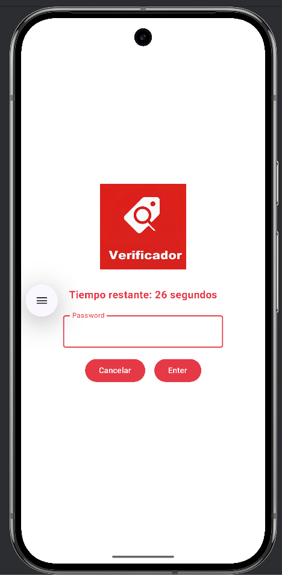
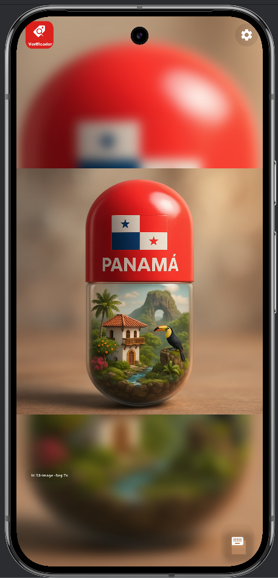

# PriceCheck: Mucho más que un Verificador de Precios

**PriceCheck** es una solución empresarial robusta desarrollada para el sector retail.---

## 📥 Descarga y Prueba
Puedes descargar el instalador (APK) para probar la solución en un entorno real o emulador:

[**Descargar PriceCheck APK**](./downloads/pricecheck-latest.apk)

*Nota: Esta versión es de desarrollo y requiere habilitar la instalación desde fuentes desconocidas.*

*Este proyecto demuestra habilidades avanzadas en desarrollo nativo Android, seguridad de dispositivos empresariales y arquitectura de software moderna.*
Transforma dispositivos Android estándar en puntos de información inteligentes, seguros y autónomos.

## 🌟 Características Destacadas

### 🎯 Consulta de Productos en Tiempo Real
- **Escaneo Versátil**: Soporta escaneo mediante cámara integrada, teclados externos (mecanismo HID) y escáneres láser profesionales.
- **Información Detallada**: Muestra precio, moneda, nombre del producto y nivel de precio configurado, todo en una interfaz optimizada para lectura rápida.
- **Integración con Retrofit**: Comunicación eficiente con servidores backend (Django/Python) para obtener datos actualizados al instante.

### 🖼️ Capturas de Pantalla

*Pantalla de configuración protegida y parametrización de red.*

*Mecanismo de seguridad con temporizador de 30 segundos.*

*Reproducción de anuncios dinámicos en espera.*

## 🔒 Modo Kiosco de Alta Seguridad (Unbreakable)
- **Multimedia Carousel**: Reproducción continua de anuncios en formato imagen y video (4K soportado).
- **ExoPlayer Integration**: Uso de la librería Media3 para una reproducción fluida y de bajo consumo de recursos.
- **Sincronización Inteligente**: Los anuncios se descargan y almacenan localmente. Si el servidor se apaga, el kiosco sigue funcionando con el contenido guardado.
- **Transiciones Suaves**: Animaciones sutiles entre contenidos para una experiencia visual premium.

### 🛡️ Seguridad de Grado Empresarial (Kiosk Mode)
Diseñado para operar en espacios públicos sin supervisión:
- **Zero-Exit Design**: Una vez iniciada, es virtualmente imposible salir de la app al sistema operativo Android sin credenciales administrativas.
- **Home Replacement**: La app actúa como el lanzador oficial del sistema.
- **Screen Pinning**: Bloqueo de botones físicos y virtuales de navegación.
- **Auto-Protection Timeout**: Si alguien accede al menú de password pero no ingresa la clave en 30 segundos, la app se autoprotege y vuelve al modo consulta.

## 🛠️ Excelencia Técnica

- **Arquitectura MVVM**: Separación clara de responsabilidades para un mantenimiento sencillo y escalabilidad.
- **Material Design 3**: Implementación de los últimos estándares de diseño de Google, incluyendo soporte para Temas Dinámicos.
- **Jetpack Compose**: UI 100% declarativa, lo que reduce errores de estado y mejora el rendimiento de renderizado.
- **Hilt (Dependency Injection)**: Código modular y fácil de testear.
- **Coroutines & Flow**: Manejo reactivo de datos y sincronización asíncrona sin bloquear la interfaz.

## 📈 Impacto del Proyecto
Este sistema no solo ayuda a los clientes a conocer los precios, sino que convierte cada terminal en un canal de marketing activo, mejorando la experiencia de compra y maximizando el retorno de inversión del hardware.

---
*Este proyecto es parte de mi portafolio como Desarrollador Senior de Android.*
